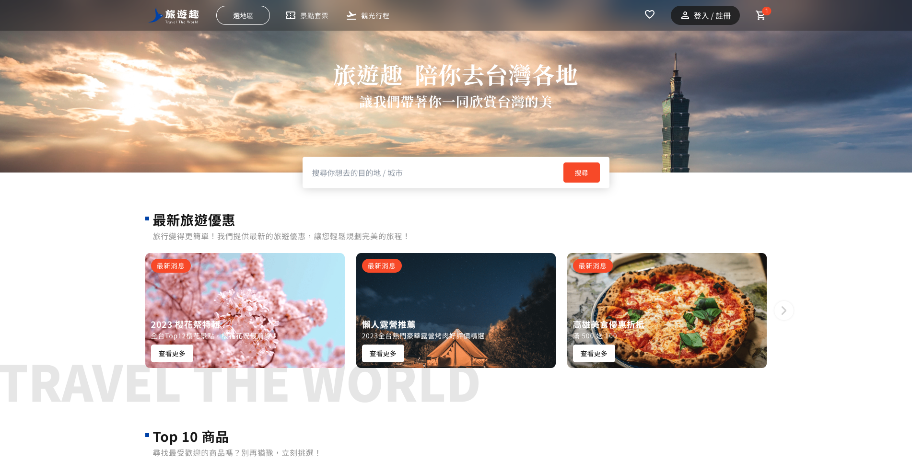

# **旅遊趣 ✈️**
> 探索世界的精彩，從這裡開始，旅遊趣帶您踏上一場奇幻之旅，發現無盡的冒險和美麗風景。

Demo : [旅遊趣](https://travel-fun.vercel.app/#/)

 

## **創店理念**
在這個充滿多元文化和美麗風景的世界中，我們相信每個地方都有其獨特的故事等待著被發現，我們希望為旅行者打造一個平台，讓他們能夠輕鬆地尋找到最適合的旅行目的地和行程安排，不論是探索遙遠的國度、感受當地風情，還是享受豪華的渡假體驗。

我們相信旅行不僅僅是到達目的地，更是一段精彩的旅程，我們的團隊致力於挖掘每個目的地的獨特之處，為旅行者提供深入的文化體驗和豐富的活動選擇，我們以用心的服務和細致的安排，讓每位旅行者在每次旅行中都能獲得滿足感和難忘的回憶。

無論您是探險家、文化愛好者、還是喜愛舒適度假的旅行者，我們都有完美的方案和行程等待著您。

讓我們一同踏上探索世界的旅程，創造屬於您的獨特旅行故事！

 

## **專案說明**
> * 使用 `Vue.js` 和 `Vite` 進行開發
> * 使用 `Vue Router` 路由設定
> * 使用 `Axios` 串接後台 API 資料
> * 使用 `props` `emit` `pinia` 進行元件間資料的傳遞
> * 使用 `Tailwind CSS` `Naive UI` 完成版面
> * 使用 `Antfu ESlint Style` 控管程式碼品質
> * 使用 `Git` 版本控制

### **使用技術**
* [Vue](https://vuejs.org/) `3.3.4` 
* [Vite](https://vitejs.dev/)
* [Vue Router](https://router.vuejs.org/zh/)`4`
* [Pinia](https://pinia.vuejs.org/)
* [Axios](https://axios-http.com/)
* [Sweetalert2](https://sweetalert2.github.io/#icons)
* [Tailwind CSS](https://tailwindcss.com/)
* [Naive UI](https://www.naiveui.com/zh-CN/dark)
* [Xicons](https://www.xicons.org/#/) `material` `antd`
* [Swiper](https://swiperjs.com/)
* [UUID](https://github.com/uuidjs/uuid)
* [Ckeditor](https://ckeditor.com/ckeditor-5/)`5`
* [Voomap](https://voomap.vercel.app/)
* [LocalStorage](https://developer.mozilla.org/zh-TW/docs/Web/API/Window/localStorage)

### 程式碼風格

### 設計稿

* 設計師：[Gill](mailto:e26290@gmail.com)
* 設計稿：[旅遊趣](https://www.figma.com/file/OqJyJviIdcYxBlAbnBUuNf/%E5%85%AD%E8%A7%92-%7C-%E6%97%85%E9%81%8A%E8%B6%A3--%E5%8F%B0%E7%81%A3%E6%97%85%E9%81%8A%E5%A5%97%E7%A5%A8%E8%A8%82%E8%B3%BC?type=design&node-id=1-1041&mode=design&t=eoVvXFBNTvKdggr6-0)

### **前台**
* 旅遊行程展示：首頁、商品列表、商品介紹等
* 收藏清單：新增、編輯、刪除收藏商品
* 購物車：新增、刪除及編輯商品數量
* 優惠卷：結帳時可套用優惠卷
* 訂單：創立訂單包含顧客資料、購買時間、購買產品等
* 結帳：選擇付款方式進行付款

### **後台**
* 管理者登入驗證
* 商品管理：新增、編輯、刪除
* 訂單管理：編輯部分訂單資訊、刪除
* 優惠卷管理：新增、修改、刪除

 

## 前台頁面介紹

### **首頁** 

### **旅遊行程**
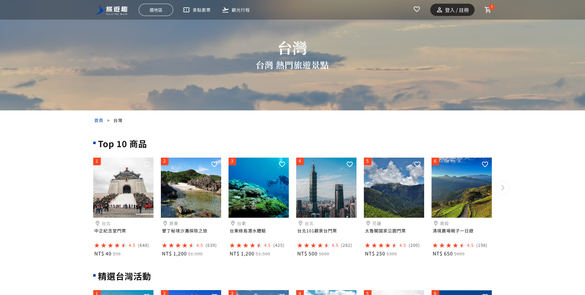
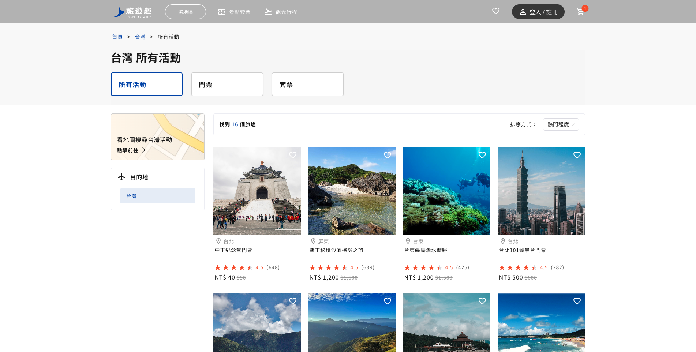
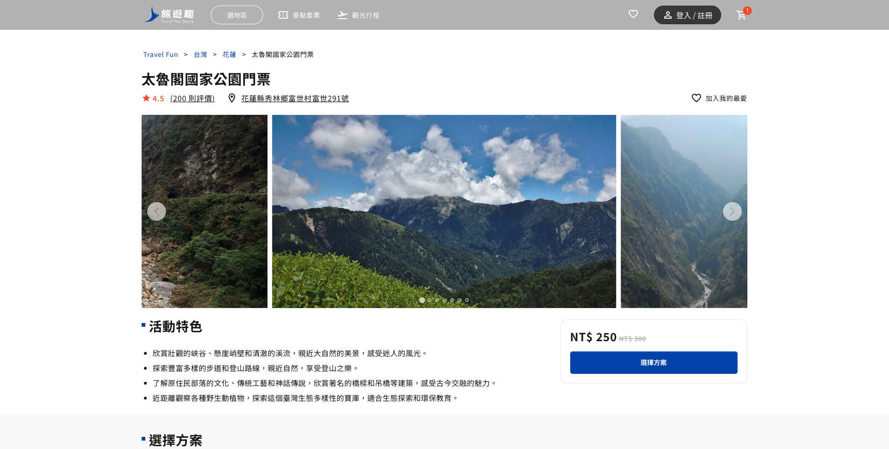

### **收藏清單**
* 利用 `LocalStorage` 儲存使用者收藏紀錄

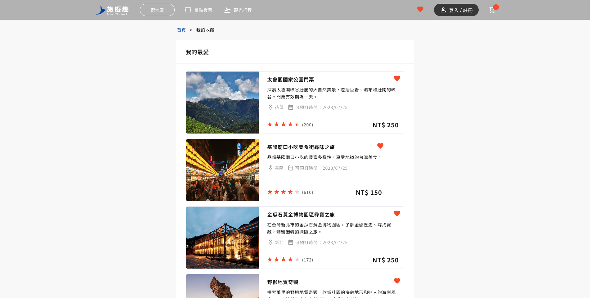

### **購物車**
* 購物車預覽
* 購物車頁面

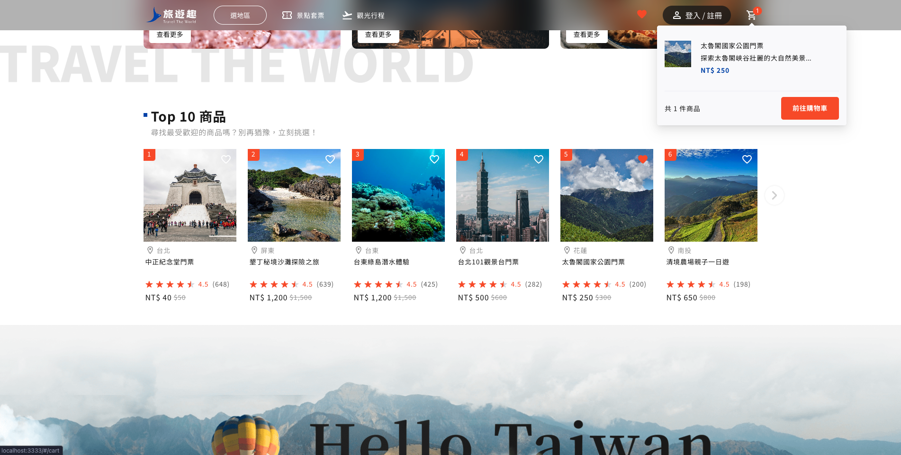

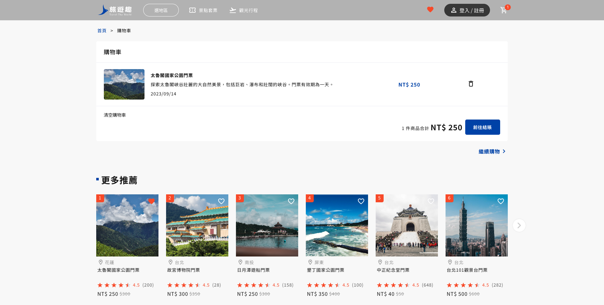

### **訂單填寫**
* 紅色星號為必填項目
* 每個欄位皆有格式驗證
* 套用優惠卷

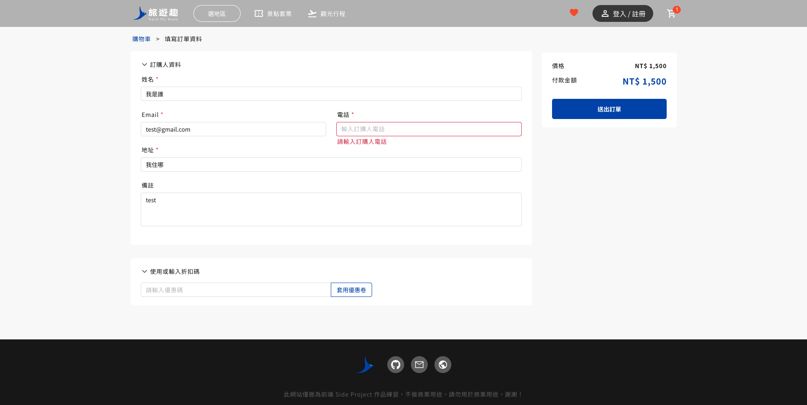
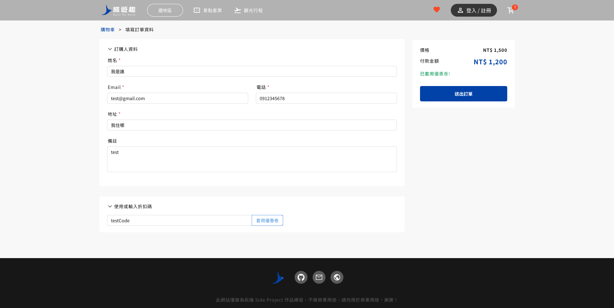

### **準備付款**
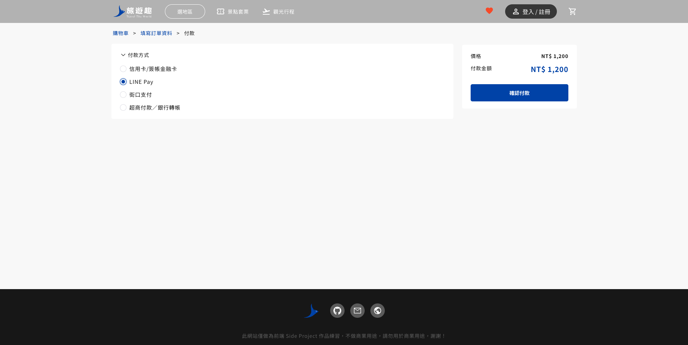

### **訂單建立**
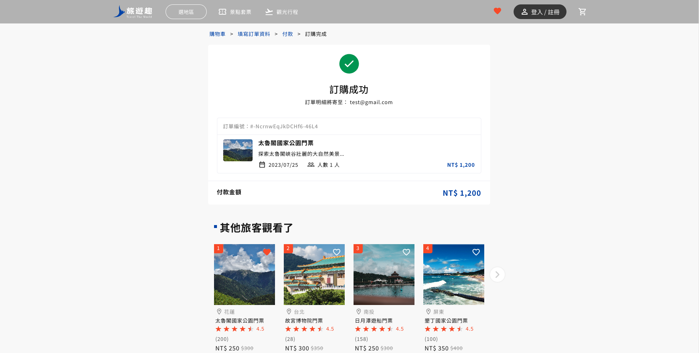

  

## 後台頁面介紹

### 登入頁面
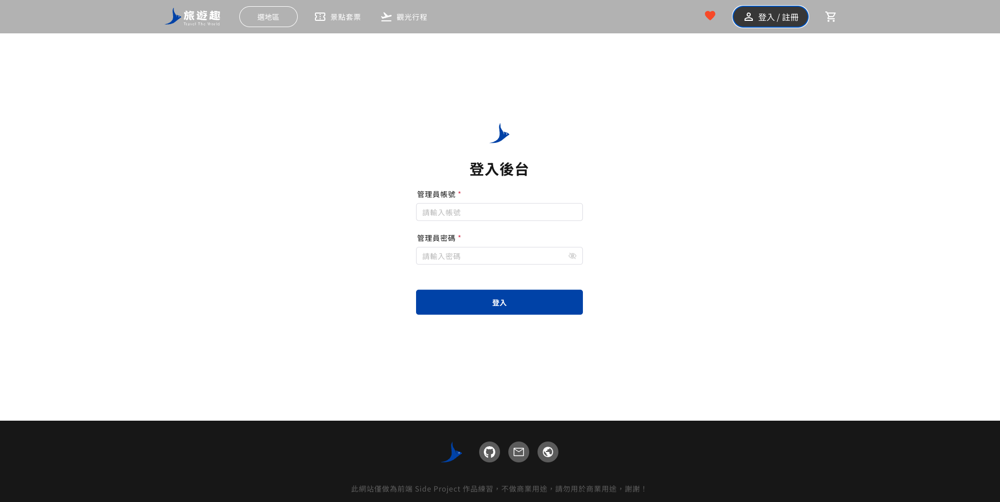

### **旅遊行程管理頁面**
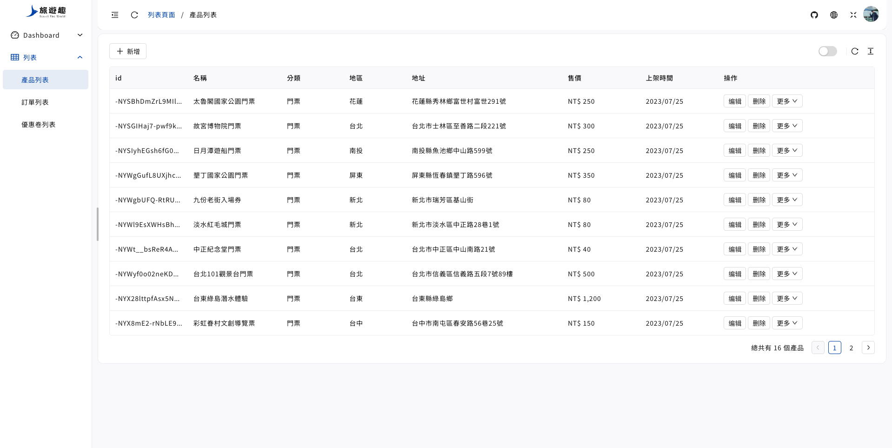

### **訂單管理**
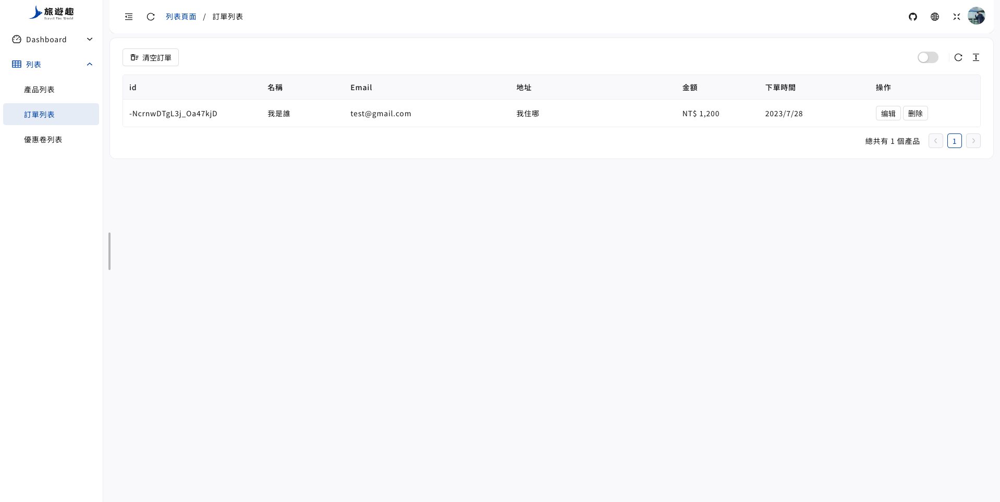

### **優惠卷管理**
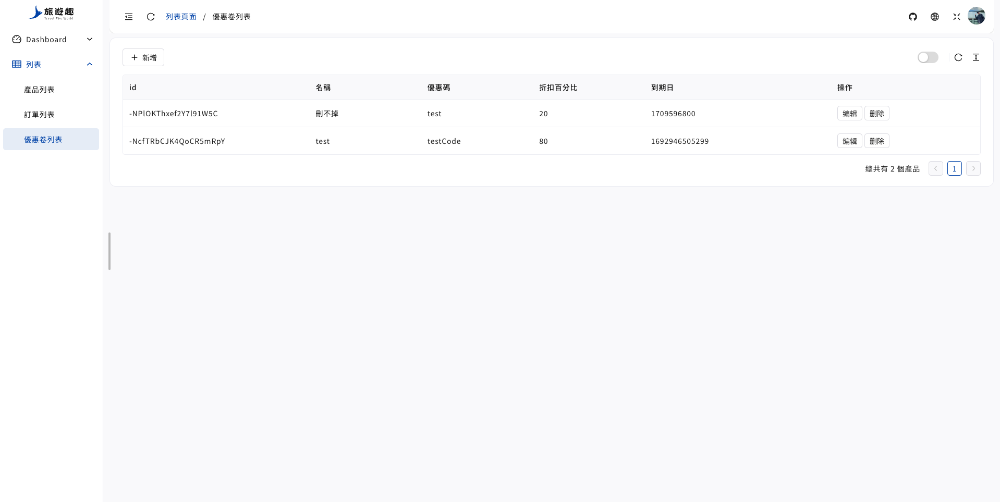

 

更多資訊歡迎前往 **[旅遊趣](https://travel-fun.vercel.app/#/)**  進一步觀看！
